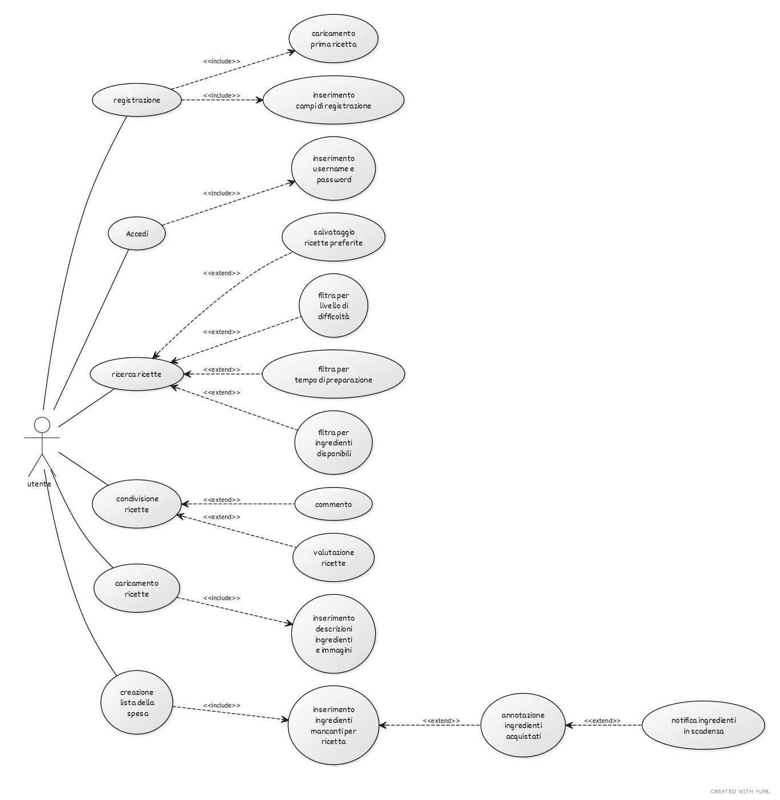

# Whats-in-Your_Fridge

 What's in your fridge è l'app che consente a tutti gli appassionati di cucina di trovare nuove ricette e idee per cucinare piatti diversi con i pochi ingredienti a disposizione, potendo poi condividerli e consigliarli ai propri amici. 
 
 Rinnova ogni giorno le tue ricette con ciò che hai in frigo!!!

Target: appassionati di cucina

Competitor: giallo zafferano, svuotafrigo, supercook,  Pimp my chef, AI chef,cookpad

1. Funzionalità Principali
  creazione utente:
-registrazione tramite email, immettendo username, nome, cognome, anno di nascita, piatto preferito e password

Accesso.
-username e password

caricamento prima ricetta:
-inserimento titolo ricetta, immagine piatto finito, difficoltà ricetta, tipo di ricetta a scelta fra (antipasto, primo, secondo, dessert, spuntino), breve descrizione,
ingredienti essenziali, ingredienti aggiuntivi, istruzioni ricetta. 

1.1. Inserimento degli Ingredienti Disponibili
L'utente deve poter inserire manualmente gli ingredienti che ha a disposizione nel frigorifero o nella dispensa.

L'utente può inserire singoli ingredienti o gruppi di ingredienti.
Possibilità di aggiornare, modificare o rimuovere gli ingredienti.

1.2. Ricerca Ricette Basata su Ingredienti Disponibili
Requisito: L'app deve fornire una lista di ricette che l'utente può preparare con gli ingredienti già presenti nel proprio frigorifero o dispensa.

Ricette mostrate in base alla compatibilità con gli ingredienti inseriti.
Ricette con ingredienti mancanti: L’app suggerisce ricette in cui solo pochi ingredienti sono mancanti e fornisce un elenco per aggiungere facilmente quegli ingredienti.
Filtro per livello di difficoltà e tempo di preparazione .

1.3. Condivisione delle Ricette con Amici
Requisito: Gli utenti devono poter condividere le ricette trovate o create con i propri amici tramite l'app.

1.4. Creazione di Ricette Personalizzate
Requisito: Gli utenti devono poter creare e caricare le proprie ricette sull'app, includendo descrizioni, ingredienti e immagini.

Sezione per aggiungere gli ingredienti, la preparazione, il tempo di cottura e una foto del piatto.
Gli utenti possono aggiornare e modificare le proprie ricette in qualsiasi momento.

1.5. Funzionalità di Lista della Spesa
Requisito: L'app deve permettere all'utente di creare una lista della spesa direttamente dall'app, aggiungendo gli ingredienti mancanti delle ricette selezionate.
Funzione di spunta per segnare gli ingredienti acquistati.

2. Funzionalità Secondarie 
2.1. Notifiche Push per Ricette Suggerite
Requisito: L'utente può ricevere notifiche push con suggerimenti di ricette basati sugli ingredienti già disponibili o sulle preferenze inserite.
Notifiche quando nuove ricette rilevanti vengono aggiunte o quando si stanno per scadere alcuni ingredienti.

2.2. Funzione "Scadenza degli Ingredienti"
Requisito: L'app può avvisare l'utente quando alcuni ingredienti stanno per scadere, suggerendo ricette da preparare prima della data di scadenza.

2.3. Funzionalità di Salvataggio delle Ricette Preferite
Requisito: Gli utenti devono poter salvare le ricette preferite in una lista personalizzata per accedervi facilmente in futuro.

2.4. Valutazioni e Commenti sulle Ricette
Requisito: Gli utenti devono poter valutare le ricette con un sistema di stelle e lasciare commenti sulle ricette che hanno provato.
Motivo: Aiuta gli utenti a identificare le ricette migliori e fornisce feedback alla community di utenti.

